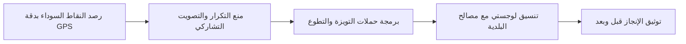

# 🌱 بيّضها | Bayedha
### المنصة الرقمية للعمل التطوعي والنظافة الحضرية - بلدية البيض
**Plateforme Citoyenne de Salubrité Publique et Valorisation Environnementale**

---

[](LICENSE)
[]()
[]()
[]()

---

## 📌 عن المشروع (Overview)
**بيّضها (Bayedha)** هي منصة تكنولوجية مدنية مفتوحة المصدر (Civic Tech) تهدف إلى إحياء مفهوم **"التويزة"** التضامني برؤية رقمية عصرية، لتوحيد طاقات المجتمع المدني، الشباب، والجمعيات في **مدينة البيض (الجزائر)** بالتنسيق المباشر مع السلطات المحلية (المجلس الشعبي البلدي APC، محافظة الغابات، الحماية المدنية، والأمن الوطني).

---

## 🌟 المحاور والوظائف الرئيسية (Core Features)



1. **الخارطة التفاعلية ورادار النقاط السوداء (Interactive Radar Map):**
   * رصد وتحديد المواقع بالصور والإحداثيات الجغرافية التلقائية.
   * فلاتر حية: نقاط سوداء، حملات مبرمجة، وفضاءات مسترجعة.
2. **منظومة التبليغ المهيكل ومنع التكرار (Structured Reporting & Proximity Engine):**
   * فحص جغرافي فوري في نطاق **85 متراً** لمنع إنشاء بلاغات مكررة لنفس النقطة.
   * تحويل البلاغ المكرر إلى **"تأكيد وتصويت تشاركي (+1)"** دون استهلاك مساحة تخزين للصور.
   * تصنيف نوع التدخل والعتاد المطلوب: (🟢 يدوي، 🟡 شاحنة 3.5T، 🔴 آليات ثقيلة وجرافة).
3. **مركز حملات التويزة والتطوع (Campaigns & Touiza Hub):**
   * إعلان وجدولة الحملات الميدانية مع تحديد العتاد المطلوب ونقاط الالتقاء وتأكيد الحضور (RSVP).
4. **سجل التحول والارتقاء البيئي (Before & After Showcase):**
   * مقارنة بصرية تفاعلية بمقبض سحب لمشاهدة تحول الفضاءات من مكبات عشوائية إلى مساحات نظيفة.
5. **دعم ثنائي كامل للغتين (Arabic RTL & Français LTR):**
   * لغة فصحى إدارية وبيئية رسمية وفرنسية مؤسساتية دقيقة.
6. **بنية تشغيلية مجانية 100% (Zero-Cost Architecture):**
   * مصممة للعمل ضمن الخطط المجانية الدائمة (OpenStreetMap + Leaflet + Supabase Free Tier + Vercel / Cloudflare).

---

## 💻 البنية التقنية (Tech Stack)

| المكون | التقنية المعتمدة | مبررات الاختيار |
| :--- | :--- | :--- |
| **واجهة المستخدم** | HTML5 / Vanilla CSS3 / JS ES6+ (PWA Ready) | سرعة فائقة، خفيفة جداً، تعمل على جميع الهواتف والمتصفحات دون الحاجة لمتجر تطبيقات. |
| **الخرائط ونظم المعلومات الجغرافية** | **Leaflet.js + OpenStreetMap** | مجانية 100% مدى الحياة بدون شروط أو بطاقات ائتمانية. |
| **قاعدة البيانات المستقبلية** | **Supabase (PostgreSQL + PostGIS)** | دعم الاستعلامات المكانية و 50,000 مستخدم نشط شهرياً في الخطة المجانية. |
| **التايبوغرافي والهوية البصرية** | **Readex Pro (AR) & Plus Jakarta Sans (FR)** | خطوط هندسية عصرية ذات مقروئية عالية وطابع مؤسساتي رصين مستوحى من طبيعة البيض السهبية. |

---

## 🚀 المعاينة والتشغيل المحلي (Quickstart)

```bash
# استنساخ المستودع
git clone https://github.com/Salahalioui/bayedha.git

# الدخول إلى المجلد
cd bayedha

# التشغيل عبر أي خادم محلي خفيف (Python كمثال)
python -m http.server 8080
```
ثم افتح المتصفح على الرابط: **`http://localhost:8080`**

---

## 📚 التوثيق المفصل (Documentation)

* 📖 **[المخطط المعماري والاستراتيجي (PROJECT_BLUEPRINT.md)](docs/PROJECT_BLUEPRINT.md)**
* 📊 **[سجل تتبع التقدم والمهام (PROGRESS_TRACKER.md)](docs/PROGRESS_TRACKER.md)**
* 🗄️ **[مخطط قاعدة البيانات والكيانات (DATA_SCHEMA.md)](docs/DATA_SCHEMA.md)**

---

## 🤝 المساهمة والتطوير المجتمعي
المشروع مبادرة مفتوحة ومستقلة لخدمة المجتمع والبيئة. نرحب بكافة المقترحات والمساهمات البرمجية والميدانية.

*تطوير: مبادرة مستقلة للارتقاء بالعمل المدني والبيئي بالجزائر 🇩🇿*
